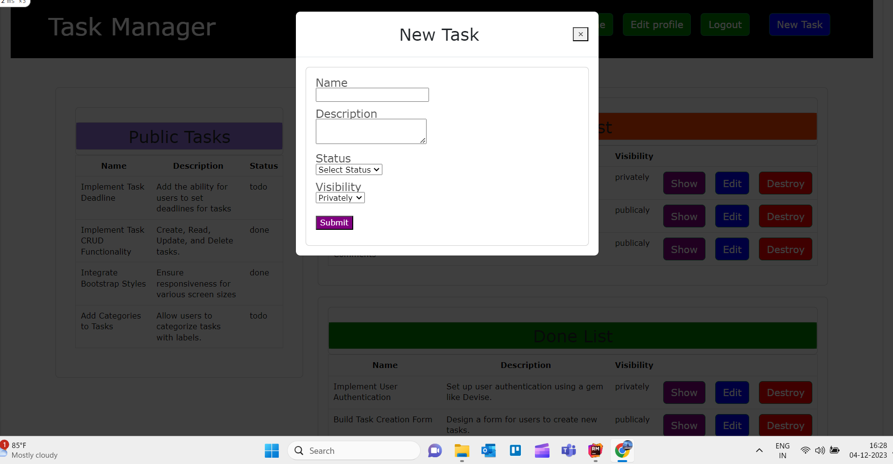

# Task Manager App

## Description

Task Manager is a simple Rails application designed to help users to manage their tasks by categorizing them into TODO and DONE lists. The application includes user authentication using the Devise gem, allowing users to secure their task lists and optionally make them public.

Screenshots of the Application

Application  Home page for Guest User

Application Login Page

Application  Home page for Logged in User

To create New Task

Application Show Page of the created Task

Application Edit Page

User Profile Edit Page

## Features

1. Manage tasks with TODO and DONE status.
2. User authentication using Devise.
3.  Public lists displayed on the homepage.
4. Loged in user can see public task of all other users.
5. Each user has their own TODO and DONE lists.

## Getting Started

### Prerequisites

* Ruby (version 3.1.3 )
* Ruby on Rails (version 6.1.7.6 )

Installation

1. Clone the repository
2. Install dependencies  
bundle install
4. Set up the database:  
rails db:create db:migrate
6. Start the Rails server:  
rails server
8. Open your browser and go to http://localhost:3000.

## Usage

* Sign up for a new account or log in with existing credentials.
* Create, edit, and manage your tasks in the TODO and DONE lists.
* Optionally make your task lists public or keep them private.

## Acknowledgments

* Devise gem for authentication.
* Ruby on Rails for the web framework.

